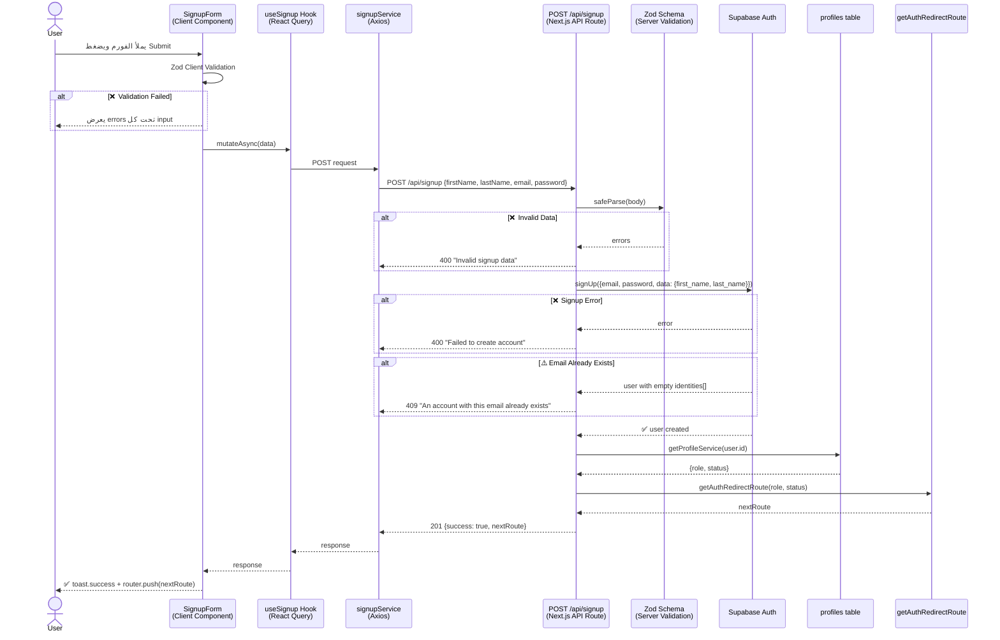
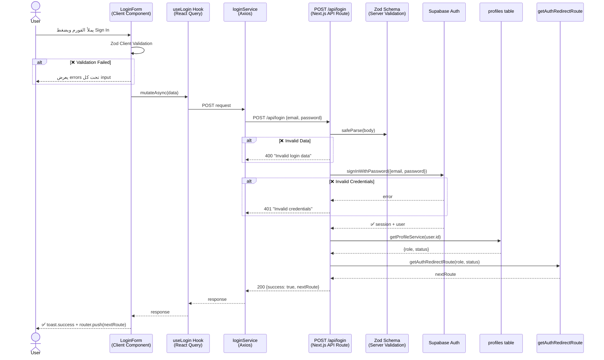
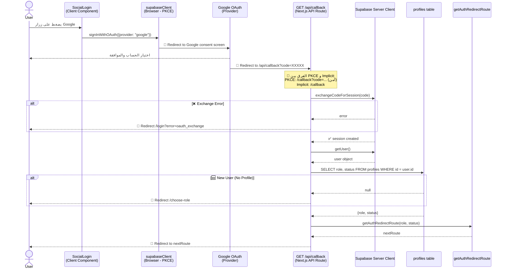
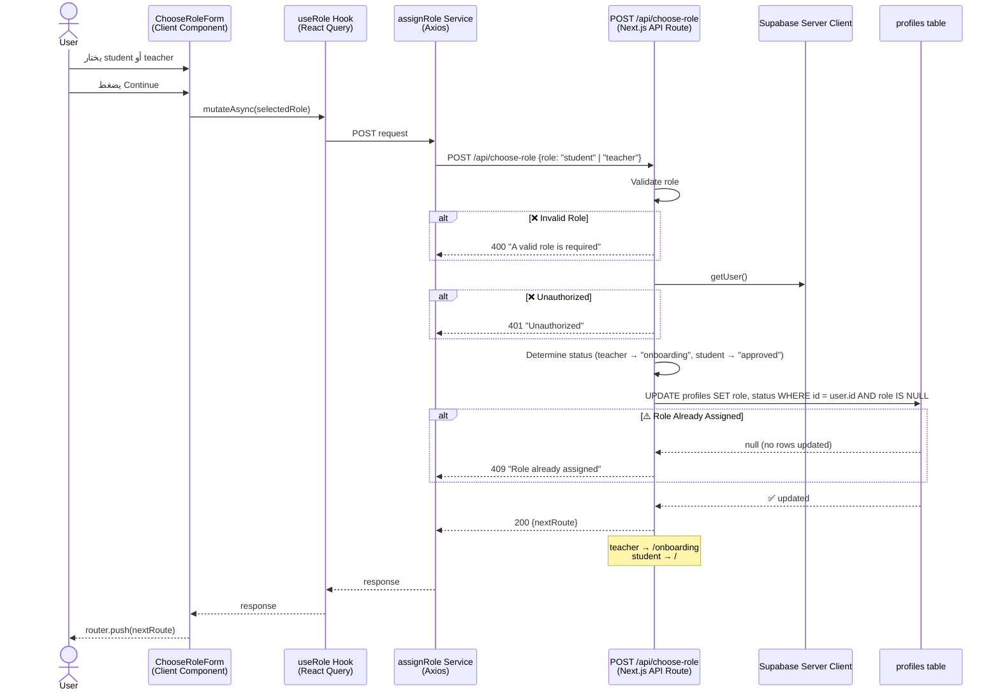
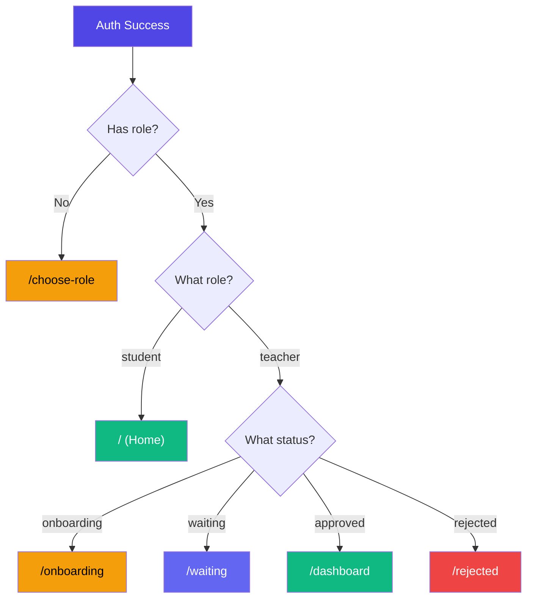
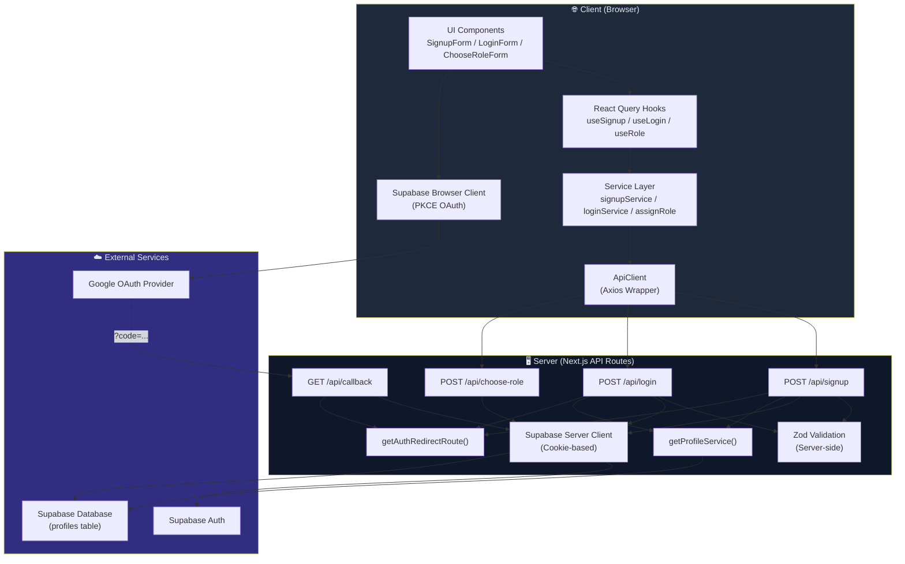
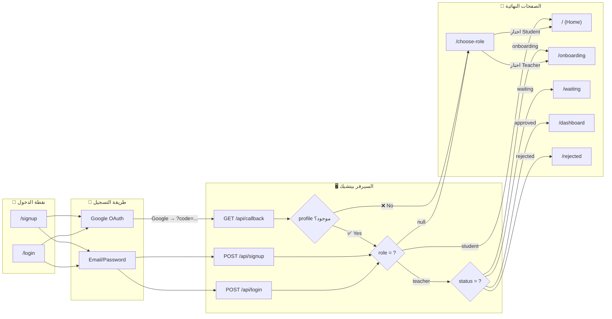

# 🔐 EduWay Authentication System Documentation

## نظرة عامة (Overview)

نظام الـ Authentication في EduWay بيعتمد على **Supabase Auth** مع **Next.js App Router** و بيدعم طريقتين للتسجيل:

1. **Email/Password** — تسجيل تقليدي بالإيميل والباسورد
2. **OAuth (Social Login)** — تسجيل عن طريق Google أو غيره باستخدام **PKCE Flow**

---

## 📁 File Structure (هيكل الملفات)

```
src/
├── lib/
│   ├── supabase/
│   │   ├── client.ts          ← Browser Supabase Client (PKCE)
│   │   └── server.ts          ← Server Supabase Client (Cookies)
│   └── axios/
│       └── apiClient.ts       ← Axios wrapper للـ API calls
│
├── features/(auth)/
│   ├── signup/
│   │   ├── components/SignupForm.tsx   ← فورم التسجيل
│   │   ├── schema/schema.ts           ← Zod validation
│   │   ├── hooks/useSignup.ts         ← React Query mutation
│   │   ├── service/signup.ts          ← API call service
│   │   ├── types/index.ts             ← AuthRole type
│   │   └── data/AuthInputConfig.ts    ← Input fields config
│   │
│   ├── login/
│   │   ├── components/LoginForm.tsx   ← فورم اللوجن
│   │   ├── schema/loginSchema.ts      ← Zod validation
│   │   ├── hooks/useLogin.ts          ← React Query mutation
│   │   ├── services/login.ts          ← API call service
│   │   └── data/login-inputs.ts       ← Input fields config
│   │
│   ├── choose-role/
│   │   ├── components/
│   │   │   ├── ChooseRoleForm.tsx      ← اختيار الدور (student/teacher)
│   │   │   └── ChooseRoleCard.tsx      ← كارد كل دور
│   │   ├── hooks/useRole.ts           ← React Query mutation
│   │   └── services/assignRole.ts     ← API call service
│   │
│   ├── shared/
│   │   ├── components/
│   │   │   ├── AuthTabs.tsx           ← Login/Signup tabs
│   │   │   ├── SocialLogin.tsx        ← OAuth buttons
│   │   │   ├── SocialIcons.tsx        ← SVG icons
│   │   │   └── AuthHeader.tsx         ← Auth page header
│   │   └── types/AuthInputs.ts       ← AuthInputConfig & AuthResponse types
│   │
│   └── onboarding/                    ← Multi-step teacher onboarding
│       ├── step-one/
│       ├── step-two/
│       └── step-three/
│
├── app/api/(auth)/
│   ├── signup/route.ts        ← POST /api/signup
│   ├── login/route.ts         ← POST /api/login
│   ├── callback/route.ts      ← GET  /api/callback (OAuth)
│   └── choose-role/route.ts   ← POST /api/choose-role
│
└── services/auth/
    ├── getProfile.ts              ← جلب بيانات الـ profile
    └── getAuthRedirectRoute.ts    ← تحديد الصفحة اللي المستخدم هيروحلها
```

---

## 🔄 Auth Flows (مسارات الـ Authentication)

### 1️⃣ Email/Password Signup Flow



### 2️⃣ Email/Password Login Flow



### 3️⃣ OAuth (Google) Login Flow — PKCE



### 4️⃣ Choose Role Flow (OAuth Users)



---

## 🗺️ Redirect Logic (خريطة التوجيه)

بعد أي عملية auth (signup, login, أو OAuth), الـ backend بيحدد الصفحة اللي المستخدم هيروح عليها بناءً على الـ **role** و **status**:



| Role | Status | Route | الوصف |
|------|--------|-------|-------|
| `null` | `null` | `/choose-role` | المستخدم لسه ما اختارش دوره |
| `student` | `approved` | `/` | الطالب بيروح على الصفحة الرئيسية |
| `teacher` | `onboarding` | `/onboarding` | المعلم لسه بيكمل بياناته |
| `teacher` | `waiting` | `/waiting` | المعلم مستني الموافقة |
| `teacher` | `approved` | `/dashboard` | المعلم تمت الموافقة عليه |
| `teacher` | `rejected` | `/rejected` | المعلم تم رفضه |

---

## 🧩 Layer-by-Layer Code Explanation (شرح الكود طبقة بطبقة)

### Layer 1: Supabase Clients (طبقة الاتصال بـ Supabase)

الأبلكيشن عنده **client اتنين** مختلفين لـ Supabase:

#### 🌐 Browser Client — [`client.ts`](file:///d:/coding/Next%20Js/my-app/src/lib/supabase/client.ts)

```typescript
export const supabaseClient = createBrowserClient(supabase_url, supabase_publishable_key, {
    auth: {
        flowType: "pkce"  // ← مهم! بيخلي OAuth يستخدم PKCE بدل Implicit
    }
})
```

**ليه PKCE مش Implicit؟**
- **Implicit Flow**: الـ access token بييجي في الـ URL كـ hash → `#access_token=...` (مكشوف في البراوزر)
- **PKCE Flow**: بييجي code مؤقت → `?code=...` والسيرفر هو اللي بيحوله لـ session (أأمن بكتير)

#### 🖥️ Server Client — [`server.ts`](file:///d:/coding/Next%20Js/my-app/src/lib/supabase/server.ts)

```typescript
export async function createSupabaseServerClient() {
    const cookieStore = await cookies();
    return createServerClient(url, key, {
        cookies: {
            getAll() { return cookieStore.getAll(); },
            setAll(cookiesToSet) {
                cookiesToSet.forEach(({ name, value, options }) => {
                    cookieStore.set(name, value, options);
                });
            },
        },
    });
}
```

**ليه بيحتاج cookies؟** لأن السيرفر مش بيعرف مين الـ user إلا من الـ cookies اللي فيها الـ session.

---

### Layer 2: Zod Validation Schemas (طبقة التحقق)

#### Signup Schema — [`schema.ts`](file:///d:/coding/Next%20Js/my-app/src/features/(auth)/signup/schema/schema.ts)

```typescript
export const signupSchema = z.object({
    firstName: z.string().min(3).max(25),
    lastName:  z.string().min(3).max(25),
    email:     z.email({ pattern: /regex/ }),
    password:  z.string().min(8).max(18)
                .regex(/^(?=.*[a-z])(?=.*[A-Z])(?=.*\d)(?=.*[@$!%*?&]).*$/),
    confirmPassword: z.string().min(1),
}).refine((val) => val.password === val.confirmPassword, {
    message: "Passwords do not match",
    path: ["confirmPassword"],  // ← الإيرور بيظهر تحت confirmPassword
});
```

> [!NOTE]
> الـ Validation بيحصل **مرتين**: مرة على الـ Client (react-hook-form + zodResolver) ومرة على الـ Server (safeParse في الـ API route). الـ Double validation ده best practice عشان حتى لو حد بعت request من Postman مثلاً، البيانات هتتفلتر.

#### Login Schema — [`loginSchema.ts`](file:///d:/coding/Next%20Js/my-app/src/features/(auth)/login/schema/loginSchema.ts)

```typescript
export const loginSchema = z.object({
    email:    z.email({ pattern: /regex/ }),
    password: z.string().min(8).max(18).regex(/strong_password_regex/),
});
```

---

### Layer 3: Services (طبقة الـ API Calls)

كل feature عندها service file بتستخدم الـ `apiClient` (Axios wrapper):

```typescript
// signup service
export const signupService = async (data: signupSchemaType): Promise<AuthResponse> => {
    return await apiClient.post<AuthResponse>("/signup", data)
}

// login service
export const loginService = async (data: LoginSchemaType): Promise<AuthResponse> => {
    return await apiClient.post<AuthResponse>("/login", data)
}

// assign role service (OAuth)
export const assignRole = async (role: AuthRole): Promise<AuthResponse> => {
    return await apiClient.post<AuthResponse>("/choose-role", { role })
}
```

الـ `apiClient` هو class wrapper حوالين Axios بيعمل extract للـ `res.data` تلقائياً:
```typescript
class ApiClient {
    async post<T>(url: string, data?: unknown): Promise<T> {
        const res = await axiosInstance.post<T>(url, data);
        return res.data;  // ← بيرجع الداتا مباشرة مش الـ response كله
    }
}
```

---

### Layer 4: React Query Hooks (طبقة إدارة الحالة)

كل feature بتستخدم `useMutation` من React Query:

```typescript
// useSignup
export const useSignup = () => {
    return useMutation({ mutationFn: signupService })
}

// useLogin
export const useLogin = () => {
    return useMutation({ mutationFn: loginService })
}

// useRole
export const useRole = () => {
    return useMutation({ mutationFn: assignRole })
}
```

**ليه React Query؟**
- `isPending` → بيعرف الـ form يعمل loading state
- `mutateAsync` → بيرجع Promise فتقدر تعمل `try/catch`
- Automatic error handling و caching

---

### Layer 5: Form Components (طبقة الـ UI)

#### SignupForm — [`SignupForm.tsx`](file:///d:/coding/Next%20Js/my-app/src/features/(auth)/signup/components/SignupForm.tsx)

```typescript
const { register, handleSubmit, formState: { errors } } = useForm<signupSchemaType>({
    resolver: zodResolver(signupSchema),  // ← ربط Zod بالفورم
});
const { mutateAsync, isPending } = useSignup()

const onSubmit = async (data: signupSchemaType) => {
    try {
        const response = await mutateAsync(data)
        toast.success("Account created successfully")
        setTimeout(() => {
            router.push(response.nextRoute)  // ← بيوجه المستخدم للصفحة الصح
        }, 400)
    } catch (err) {
        // Error handling مع Axios error parsing
    }
};
```

#### SocialLogin — [`SocialLogin.tsx`](file:///d:/coding/Next%20Js/my-app/src/features/(auth)/shared/components/SocialLogin.tsx)

```typescript
async function handleOAuth(provider: Provider) {
    const { error } = await supabaseClient.auth.signInWithOAuth({
        provider,
        options: {
            // بعد ما Google يخلص، بيرجع المستخدم على /api/callback
            redirectTo: `${process.env.NEXT_PUBLIC_APP_URL}/api/callback`,
        }
    })
}
```

> [!IMPORTANT]
> الـ `SocialLogin` component بيستخدم الـ **Browser Client** مباشرة (مش API route) لأن الـ OAuth redirect لازم يحصل من البراوزر. بس الـ token exchange بيحصل على السيرفر في `/api/callback`.

---

### Layer 6: API Routes (طبقة السيرفر)

#### POST `/api/signup` — [`route.ts`](file:///d:/coding/Next%20Js/my-app/src/app/api/(auth)/signup/route.ts)

1. **Validate** بـ Zod (server-side)
2. **SignUp** مع Supabase → `supabase.auth.signUp()`
3. **Check** لو الإيميل مسجل قبل كده (identities check)
4. **Get Profile** → جلب الـ role و status
5. **Redirect** → تحديد الصفحة التالية

```typescript
// ✨ Supabase quirk: email already registered
if (data.user.identities?.length === 0) {
    return NextResponse.json(
        { message: "An account with this email already exists" },
        { status: 409 }
    );
}
```

> [!WARNING]
> Supabase مش بيرجع error لما الإيميل يكون متسجل قبل كده! بدل كده بيرجع user عادي بس الـ `identities` array بيكون فاضي. لازم تشيك عليه manually.

#### GET `/api/callback` — [`route.ts`](file:///d:/coding/Next%20Js/my-app/src/app/api/(auth)/callback/route.ts)

ده الـ route اللي Google بيرجع عليه بعد الـ OAuth:

1. **Extract code** من الـ URL query params
2. **Exchange** الـ code لـ session → `exchangeCodeForSession(code)`
3. **Get user** من الـ session الجديد
4. **Check profile** → لو مفيش profile → `/choose-role`
5. **Redirect** بناءً على role و status

#### POST `/api/choose-role` — [`route.ts`](file:///d:/coding/Next%20Js/my-app/src/app/api/(auth)/choose-role/route.ts)

```typescript
// بيحدد الـ status الأولي بناءً على الـ role
const status = role === "teacher" ? "onboarding" : "approved";

// بيعمل update بس لو الـ role لسه null (ما اتختارش قبل كده)
const { data } = await supabase
    .from("profiles")
    .update({ role, status })
    .eq("id", user.id)
    .is("role", null)     // ← حماية من تغيير الـ role مرتين
    .select("id")
    .maybeSingle();
```

---

### Layer 7: Shared Services (خدمات مشتركة)

#### getAuthRedirectRoute — [`getAuthRedirectRoute.ts`](file:///d:/coding/Next%20Js/my-app/src/services/auth/getAuthRedirectRoute.ts)

الفانكشن دي بتاخد `role` و `status` وبترجع الـ route المناسب:

```typescript
export function getAuthRedirectRouteService(role: string, status: string): string {
    if (!role || !status) return "/choose-role";
    if (role === "student") return "/";
    if (role === "teacher") {
        switch (status) {
            case "onboarding": return "/onboarding";
            case "waiting":    return "/waiting";
            case "approved":   return "/dashboard";
            case "rejected":   return "/rejected";
        }
    }
    return "/";
}
```

---

## 🏗️ Architecture Overview (الهيكل العام)



---

## 🔑 Shared Types (الأنواع المشتركة)

```typescript
// الـ response اللي كل auth endpoint بيرجعه
interface AuthResponse {
    nextRoute: string;
    success: boolean;
}

// الأدوار المتاحة
type AuthRole = "student" | "teacher";

// Config لكل input field
interface AuthInputConfig<T extends string = string> {
    name: T;
    type: string;
    placeholder?: string;
    icon: LucideIcon;
    id?: string;
    halfWidth?: boolean;
}
```

---

## 📋 Summary Table (جدول ملخص)

| Feature | Client Component | Hook | Service | API Route | Schema |
|---------|-----------------|------|---------|-----------|--------|
| **Signup** | `SignupForm.tsx` | `useSignup` | `signupService` | `POST /api/signup` | `signupSchema` |
| **Login** | `LoginForm.tsx` | `useLogin` | `loginService` | `POST /api/login` | `loginSchema` |
| **OAuth** | `SocialLogin.tsx` | — | — | `GET /api/callback` | — |
| **Choose Role** | `ChooseRoleForm.tsx` | `useRole` | `assignRole` | `POST /api/choose-role` | — |

> [!TIP]
> **Pattern واضح**: كل feature بتتبع نفس الـ structure:
> `Component → Hook (React Query) → Service (Axios) → API Route → Supabase`
> وده بيخلي الكود consistent و سهل يتوسع.


## 🧭 الحالة الأولى: تسجيل بالإيميل والباسورد (Email/Password)

```
/signup → /choose-role → (حسب الدور)
```

**بالتفصيل:**

| الخطوة | الصفحة | ايه اللي بيحصل | بناءً على ايه بيعمل Redirect |
|--------|--------|---------------|------------------------------|
| 1 | `/signup` | المستخدم بيملأ الفورم (اسم، إيميل، باسورد) | بعد نجاح الـ API call، السيرفر بيرجع `nextRoute` |
| 2 | ايه الـ `nextRoute`؟ | السيرفر بيجيب الـ **profile** من الداتابيز وبيبص على الـ `role` و `status` | ← `getAuthRedirectRoute(role, status)` |

**السيناريوهات اللي ممكن تحصل بعد الـ Signup:**

| الـ role | الـ status | بيروح فين | ليه |
|---------|-----------|-----------|-----|
| `null` | `null` | `/choose-role` | الـ profile اتعمل بس الـ role لسه ما اتحددش ❶ |
| `student` | `approved` | `/` (Home) | طالب → مش محتاج حاجة تانية |
| `teacher` | `onboarding` | `/onboarding` | معلم جديد → محتاج يكمل بياناته |

> ❶ ده الأرجح في أول مرة signup لأن الـ Supabase trigger بيعمل profile بـ `role = null`

**بعد `/choose-role`:**

| اختار ايه | الـ status اللي بيتحط | بيروح فين |
|-----------|-----------------------|-----------|
| **Student** | `approved` | `/` (Home) ✅ |
| **Teacher** | `onboarding` | `/onboarding` → يكمل 3 steps |

---

## 🧭 الحالة التانية: تسجيل بـ Google OAuth

```
/login أو /signup → Google → /api/callback → (حسب الحالة)
```

**بالتفصيل:**

| الخطوة | الصفحة/المكان | ايه اللي بيحصل |
|--------|---------------|---------------|
| 1 | `/login` أو `/signup` | المستخدم بيدوس على زرار **Google** |
| 2 | `accounts.google.com` | بيختار حسابه ويوافق |
| 3 | `/api/callback?code=...` | Google بيرجع المستخدم مع code مؤقت |
| 4 | (في السيرفر) | السيرفر بيحول الـ code لـ session |
| 5 | (في السيرفر) | بيبص على الـ **profiles table** |

**بعد الـ Callback، السيرفر بيقرر:**

| الحالة | بيروح فين | ليه |
|--------|-----------|-----|
| 🆕 **مفيش profile** | `/choose-role` | مستخدم جديد، لسه ما اختارش دوره |
| profile موجود بس **role = null** | `/choose-role` | عنده profile بس ما اختارش |
| **student** + `approved` | `/` (Home) | طالب عادي |
| **teacher** + `onboarding` | `/onboarding` | معلم لسه بيكمل بياناته |
| **teacher** + `waiting` | `/waiting` | معلم مستني الموافقة |
| **teacher** + `approved` | `/dashboard` | معلم تمت الموافقة عليه |
| **teacher** + `rejected` | `/rejected` | معلم تم رفضه |

---

## 🔀 الرحلة الكاملة بالرسم:



---

## ✨ ملخص سريع

**القرار بيتاخد بناءً على حاجتين بس** من الـ `profiles` table:
1. **`role`** → `null` | `student` | `teacher`
2. **`status`** → `null` | `onboarding` | `waiting` | `approved` | `rejected`

والفانكشن اللي بتاخد القرار ده هي [`getAuthRedirectRouteService()`](file:///d:/coding/Next%20Js/my-app/src/services/auth/getAuthRedirectRoute.ts) في كل الحالات (signup, login, و callback).

