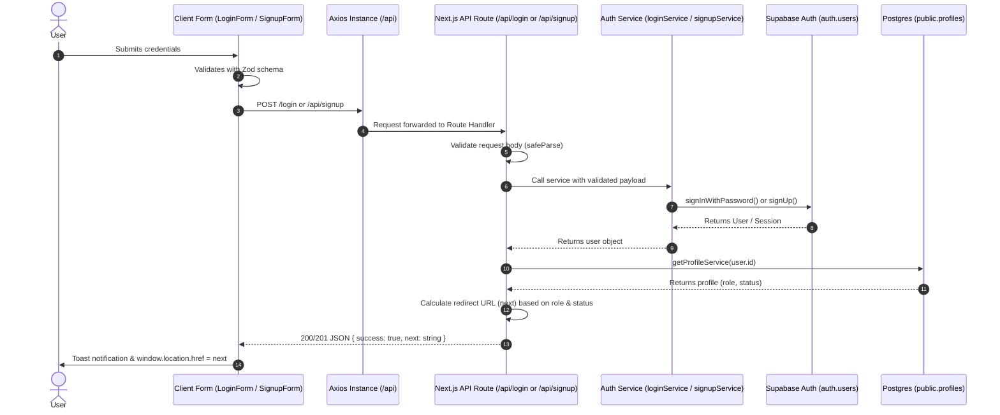
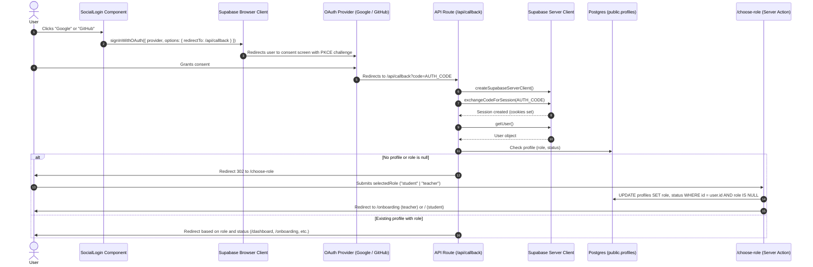
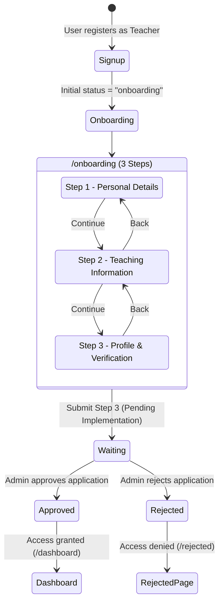
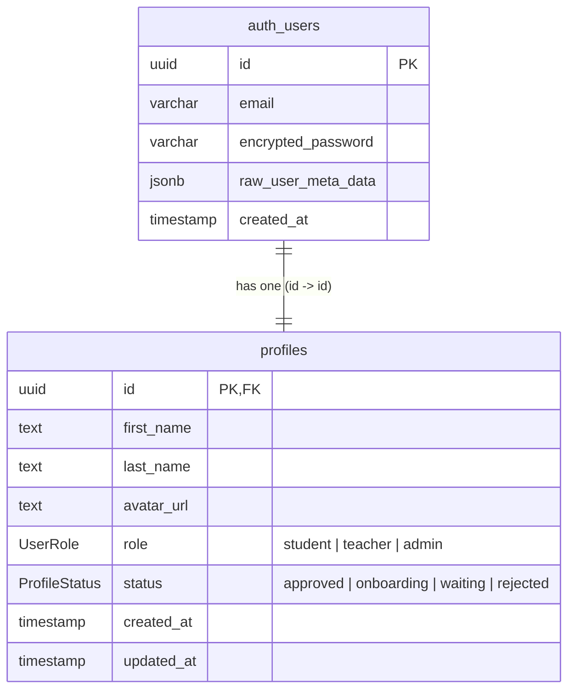

# EduWay Authentication Documentation

This document serves as the comprehensive technical reference for the authentication and authorization architecture in the **EduWay** platform. It is written for developers joining the project who need to understand, debug, maintain, and extend the authentication system.

---

## 1. Overview

### What Authentication System EduWay Uses
EduWay uses **Supabase Authentication** backed by PostgreSQL, integrated into a Next.js (App Router) project using `@supabase/ssr`, TypeScript, and Zod validation.

### Where Authentication Is Handled
EduWay uses a **hybrid architecture** combining client-side interactive forms, server-side Next.js Route Handlers, OAuth callback handlers, and Server Actions:

1. **Client-Side Components:** Capture input, validate forms using Zod schemas, handle UI transitions, and initiate OAuth redirects.
2. **Next.js API Route Handlers:** Act as an intermediate API layer (`/api/login`, `/api/signup`, `/api/callback`) for credentials validation and profile-based redirect resolution.
3. **Supabase Services:** Wrap Supabase client SDK calls (`signUp`, `signInWithPassword`, `getProfileService`).
4. **Server Actions:** Handle post-OAuth role assignment (`assignRoleAction`) securely on the server.
5. **Database Profiles Table:** Extends `auth.users` with application-specific metadata (`role`, `status`).

### Core Concepts Used in EduWay

| Concept | Implementation in EduWay |
|---|---|
| **Identity Provider** | Supabase Auth (`auth.users`) |
| **Auth Methods** | Email + Password credentials; OAuth 2.0 (Google, GitHub) |
| **OAuth Flow Type** | **PKCE** (Proof Key for Code Exchange) configured in `@supabase/ssr` |
| **Session Management** | Managed via cookies through `@supabase/ssr` |
| **Application Profile** | `public.profiles` table with foreign key `id -> auth.users.id` |
| **Role Types** | `student`, `teacher`, `admin` (defined in `src/types/index.ts`) |
| **Profile Statuses** | `approved`, `onboarding`, `waiting`, `rejected` |

### Authentication vs. Authorization in EduWay
- **Authentication ("Who are you?"):** Handled by Supabase Auth. Verifies credentials or OAuth tokens and establishes a session.
- **Authorization ("What are you allowed to do?"):** Handled by application profile data and helper functions:
  - Role check (`profile.role`: `student` vs. `teacher` vs. `admin`)
  - Status check (`profile.status`: `onboarding`, `waiting`, `approved`, `rejected`)
  - Granular helpers in `src/lib/authorization/permissions.ts` (`isUserHasPermission`, `getUserPermissions`)
  - Ownership helper in `src/lib/authorization/ownership.ts` (`checkOwnership`)

> [!NOTE]
> Next.js edge middleware (`middleware.ts`) for global route guarding is **not currently implemented** in the repository. Protection is currently enforced at the action/route handler level.

---

## 2. Authentication Architecture

### Credential-Based Authentication (Email & Password)


### OAuth 2.0 PKCE Flow (Google & GitHub)


---

## 3. Authentication Files

The following table documents every file involved in authentication across the repository.

| File Path | Responsibility | Depends On | Dependent Files | Cautions / Developer Notes |
|---|---|---|---|---|
| `src/lib/supabase/client.ts` | Creates browser Supabase client via `createBrowserClient` with `flowType: "pkce"`. | `@supabase/ssr`, env vars | `SocialLogin.tsx`, `login.ts`, `signupService.ts`, `getProfile.ts` | Throws immediately on module load if `NEXT_PUBLIC_SUPABASE_URL` or `NEXT_PUBLIC_SUPABASE_PUBLISHABLE_KEY` is undefined. |
| `src/lib/supabase/server.ts` | Async helper creating server Supabase client via `createServerClient` wired with `next/headers` `cookies()`. | `@supabase/ssr`, `next/headers` | `callback/route.ts`, `assignRole.ts` | Must be awaited: `await createSupabaseServerClient()`. Set cookies catch block intentionally suppresses errors in Server Components. |
| `src/lib/axiosInstance.ts` | Preconfigured Axios client with `baseURL: "${process.env.NEXT_PUBLIC_APP_URL}/api"`. | `axios`, `NEXT_PUBLIC_APP_URL` | `LoginForm.tsx`, `SignupForm.tsx` | Base URL already includes `/api`. Appending `/api/...` in calls causes duplicate `/api/api/...` unless relative paths are handled correctly. |
| `src/types/index.ts` | Core domain types: `UserRole`, `ProfileStatus`, `Profile`. | None | `getProfile.ts`, `permissions.ts`, `ownership.ts` | Canonical reference for profile schema in TypeScript. |
| `src/services/auth/getProfile.ts` | Reads single profile row from `profiles` table by user UUID. | `supabaseClient`, `Profile` | `signup/route.ts`, `login/route.ts` | Uses `supabaseClient` (browser client). Throws error if profile row does not exist. |
| `src/services/auth/signup/signupService.ts` | Invokes `supabaseClient.auth.signUp()` with metadata (`first_name`, `last_name`, `role`). | `supabaseClient`, `signupSchemaType` | `src/app/api/(auth)/signup/route.ts` | Metadata is sent in `options.data`, which populates `auth.users.raw_user_meta_data`. |
| `src/services/auth/login/login.ts` | Invokes `supabaseClient.auth.signInWithPassword({ email, password })`. | `supabaseClient`, `LoginSchemaType` | `src/app/api/(auth)/login/route.ts` | Throws Supabase `AuthError` on failure. |
| `src/app/api/(auth)/signup/route.ts` | POST endpoint: validates body, calls `signupService`, fetches profile, decides redirect route. | `signupSchema`, `signupService`, `getProfileService` | Client `SignupForm.tsx` | Returns HTTP 201 on success or HTTP 400 on error. |
| `src/app/api/(auth)/login/route.ts` | POST endpoint: validates body, calls `loginService`, fetches profile, decides redirect route. | `loginSchema`, `loginService`, `getProfileService` | Client `LoginForm.tsx` | Returns HTTP 200 on success, HTTP 401 on invalid credentials, HTTP 400 on validation failure. |
| `src/app/api/(auth)/callback/route.ts` | GET endpoint for OAuth PKCE callback: exchanges code, fetches profile, redirects user. | `createSupabaseServerClient` | External OAuth providers | Redirects to `/login?error=...` on failures, or `/choose-role` for new OAuth users. |
| `src/features/(auth)/signup/schema/schema.ts` | Zod validation schema (`signupSchema`) and inferred type `signupSchemaType`. | `zod` | `SignupForm.tsx`, `signup/route.ts`, `signupService.ts` | Enforces name lengths, email regex, strong password regex, role enum, and password confirmation check. |
| `src/features/(auth)/signup/components/SignupForm.tsx` | Client form component for user registration with role selector and social buttons. | `react-hook-form`, `zodResolver`, `axiosInstance`, `sonner` | `src/app/(auth)/signup/page.tsx` | Calls `axiosInstance.post("/api/signup", data)`. Redirects using `location.href = response.next`. |
| `src/features/(auth)/signup/components/RoleSelector.tsx` | Toggle buttons selecting between `"student"` and `"teacher"` roles in signup. | `RoleOption.ts`, `types` | `SignupForm.tsx` | Directly updates `selectedRole` state and React Hook Form value. |
| `src/features/(auth)/login/schema/loginSchema.ts` | Zod validation schema (`loginSchema`) and inferred type `LoginSchemaType`. | `zod` | `LoginForm.tsx`, `login/route.ts`, `login.ts` | Validates email format and password strength rules. |
| `src/features/(auth)/login/components/LoginForm.tsx` | Client form component for signing in with email/password and social login. | `react-hook-form`, `zodResolver`, `axiosInstance`, `sonner` | `src/app/(auth)/login/page.tsx` | Calls `axiosInstance.post("/login", data)`. Redirects using `location.href = response.next`. |
| `src/features/(auth)/choose-role/actions/assignRole.ts` | Server Action (`"use server"`) updating newly authenticated OAuth profile with role and initial status. | `createSupabaseServerClient`, `next/navigation` | `ChooseRoleForm.tsx` | Enforces `where id = user.id and role is null`. Redirects to `/onboarding` or `/`. |
| `src/features/(auth)/choose-role/components/ChooseRoleForm.tsx` | Client selection interface for picking student/teacher role after OAuth signup. | `assignRoleAction`, `rolesData` | `src/app/(auth)/choose-role/page.tsx` | Uses React `useTransition` while invoking `assignRoleAction`. |
| `src/features/(auth)/shared/components/SocialLogin.tsx` | Client component rendering Google and GitHub OAuth trigger buttons. | `supabaseClient`, `socialProviders` | `LoginForm.tsx`, `SignupForm.tsx` | Calls `supabaseClient.auth.signInWithOAuth()` with PKCE redirect to `/api/callback`. |
| `src/features/(auth)/shared/components/AuthTabs.tsx` | Tab buttons switching navigation between `/login` and `/signup`. | `next/link` | `LoginForm.tsx`, `SignupForm.tsx` | Pure UI switcher. |
| `src/features/(auth)/shared/components/AuthHeader.tsx` | Header bar with logo and theme toggler for authentication pages. | `Logo`, `AnimatedThemeToggler` | `login/page.tsx`, `signup/page.tsx`, `choose-role/page.tsx` | Shared layout element. |
| `src/features/(auth)/onboarding/components/TeacherOnboardingContainer.tsx` | 3-step wizard container for teacher profile onboarding. | Step form components | `src/app/(onboarding)/onboarding/page.tsx` | Notice: Step 3 finish callback (`onFinish={() => {}}`) is currently an unhandled stub. |
| `src/lib/authorization/permissions.ts` | Role-to-permission mapping and checking functions (`isUserHasPermission`). | None (relies on User/Permission types) | Authorization checks | Note: Contains stubbed types `User`, `course`, `RolePermissions`. |
| `src/lib/authorization/ownership.ts` | Resource ownership check (`checkOwnership`). | None | Resource mutations | Note: Contains stubbed types `User`, `course`. |

---

## 4. Signup Flow

### Step-by-Step Execution Trace

1. **User Visits Page:** User navigates to `/signup` (`src/app/(auth)/signup/page.tsx`), which renders `SignUpHero` (left) and `AuthHeader` + `SignupForm` (right).
2. **Role Selection:** Defaults to `"student"`. The user can switch to `"teacher"` via `RoleSelector.tsx`.
3. **Client-side Form Validation:**
   - Form state managed by `react-hook-form` using `@hookform/resolvers/zod` with `signupSchema`.
   - Fields validated:
     - `firstName`: string, 3 to 25 characters.
     - `lastName`: string, 3 to 25 characters.
     - `email`: custom regex verifying valid domain and no double dots.
     - `password`: 8 to 18 characters, requiring at least one lowercase, one uppercase, one number, and one special character (`[@$!%*?&]`).
     - `confirmPassword`: validated via `.refine()` to match `password`.
     - `selectedRole`: `"student" | "teacher"`.
4. **Form Submission:** `SignupForm.tsx` sends a POST request with the form data using `axiosInstance`:
   ```ts
   const request = await axiosInstance.post("/api/signup", data);
   ```
5. **API Route Handling (`src/app/api/(auth)/signup/route.ts`):**
   - The route parses the JSON body and performs server-side validation using `signupSchema.safeParse(body)`.
   - If validation fails, responds with `400 Bad Request` and field error details:
     ```json
     { "message": "Invalid signup data", "errors": { ... } }
     ```
6. **Supabase Auth User Creation:**
   - The route delegates to `signupService` in `src/services/auth/signup/signupService.ts`:
     ```ts
     const { data: user, error } = await supabaseClient.auth.signUp({
         email,
         password,
         options: {
             data: {
                 first_name: firstName,
                 last_name: lastName,
                 role: selectedRole
             }
         }
     });
     ```
   - Supabase creates a new record in `auth.users` with the user metadata.
7. **Profile Resolution:**
   - Immediately after user creation, the route retrieves the user's profile row:
     ```ts
     const { role, status } = await getProfileService(user.id);
     ```
8. **Redirect Route Computation:**
   - **Student:** `next = "/"`
   - **Teacher:** Evaluates `status`:
     - `"onboarding"` $\rightarrow$ `next = "/onboarding"`
     - `"waiting"` $\rightarrow$ `next = "/waiting"`
     - `"approved"` $\rightarrow$ `next = "/dashboard"`
     - `"rejected"` $\rightarrow$ `next = "/rejected"`
9. **API Response & Navigation:**
   - The route responds with `201 Created`:
     ```json
     { "success": true, "next": "/onboarding" }
     ```
   - Client displays a Sonner toast (`toast.success("Account created successfully")`) and triggers hard navigation after 400ms:
     ```ts
     setTimeout(() => {
         location.href = response.next;
     }, 400);
     ```
10. **Error Flow:**
    - If Supabase or validation throws, the route returns `400 Bad Request` with `{ message }`.
    - `SignupForm.tsx` extracts `error.response?.data?.message ?? "Failed to create account"` and triggers `toast.error(message)`.

---

## 5. Supabase Auth Integration

The table below lists all Supabase Auth SDK methods used in the codebase.

| Method | Invocation Location | Purpose | Returns | Error Handling |
|---|---|---|---|---|
| `supabaseClient.auth.signUp(...)` | `src/services/auth/signup/signupService.ts` | Creates a new user with credentials and metadata (`first_name`, `last_name`, `role`). | `{ data: { user, session }, error }` | If `error` is returned, it is thrown and caught in `signup/route.ts`. |
| `supabaseClient.auth.signInWithPassword(...)` | `src/services/auth/login/login.ts` | Authenticates existing user with email and password. | `{ data: { user, session }, error }` | If `error` is returned, it is thrown and caught in `login/route.ts`. |
| `supabaseClient.auth.signInWithOAuth(...)` | `src/features/(auth)/shared/components/SocialLogin.tsx` | Starts OAuth PKCE flow with Google or GitHub. | `{ data: { provider, url }, error }` | If `error` is returned, thrown to client. On success, redirects browser to provider. |
| `supabase.auth.exchangeCodeForSession(code)` | `src/app/api/(auth)/callback/route.ts` | Server-side PKCE code exchange: turns auth code into session cookies. | `{ data: { user, session }, error }` | On error, redirects to `/login?error=oauth_exchange`. |
| `supabase.auth.getUser()` | `src/app/api/(auth)/callback/route.ts` | Validates session cookies on the server and fetches current `User`. | `{ data: { user }, error }` | On error or null user, redirects to `/login?error=user_not_found`. |
| `supabase.auth.getUser()` | `src/features/(auth)/choose-role/actions/assignRole.ts` | Authenticates user in Server Action before applying role update. | `{ data: { user }, error }` | If not authenticated, redirects to `/login?error=unauthorized`. |

### Unimplemented Supabase Auth Methods
The following standard methods **do not exist** in the repository:
- `supabase.auth.signOut()`: **Not implemented.** There is currently no logout route, action, or button in the codebase.
- `supabase.auth.getSession()`: **Not called directly.** The codebase uses `getUser()` for secure server-side validation.
- `supabase.auth.resetPasswordForEmail()`: **Not implemented.** `/forgot-password` is linked in the UI but has no backing service.

---

## 6. User Profile Creation

### Connection Between `auth.users` and `public.profiles`

```text
auth.users (Supabase Managed)
    │
    │  id (UUID, Primary Key)
    │  raw_user_meta_data -> { first_name, last_name, role }
    │
    ▼ [PostgreSQL Database Trigger: on_auth_user_created]
public.profiles
    │
    ├── id (UUID, FK -> auth.users.id ON DELETE CASCADE)
    ├── first_name (text)
    ├── last_name (text)
    ├── avatar_url (text, nullable)
    ├── role ("student" | "teacher" | "admin")
    ├── status ("approved" | "onboarding" | "waiting" | "rejected")
    ├── created_at (timestamp)
    └── updated_at (timestamp)
```

### Database Trigger Implementation Details
While SQL migration files are **not tracked in the git repository** (they are managed directly in Supabase), the codebase depends on the following database trigger behavior:

1. **Trigger Event:** Executes `AFTER INSERT ON auth.users FOR EACH ROW`.
2. **Metadata Extraction:**
   - Reads `new.raw_user_meta_data->>'first_name'` $\rightarrow$ `profiles.first_name`
   - Reads `new.raw_user_meta_data->>'last_name'` $\rightarrow$ `profiles.last_name`
   - Reads `new.raw_user_meta_data->>'role'` $\rightarrow$ `profiles.role`
3. **Default Values Applied:**
   - For email signups where `role = 'student'`, `status` defaults to `'approved'`.
   - For email signups where `role = 'teacher'`, `status` defaults to `'onboarding'`.
   - For OAuth signups, `raw_user_meta_data` does not contain `role`. Thus, `profiles.role` is initialized as `NULL` or the profile row is deferred, triggering the `/choose-role` redirect.
4. **Expected SQL Trigger Definition:**
   ```sql
   create or replace function public.handle_new_user()
   returns trigger as $$
   begin
     insert into public.profiles (id, first_name, last_name, role, status)
     values (
       new.id,
       new.raw_user_meta_data->>'first_name',
       new.raw_user_meta_data->>'last_name',
       (new.raw_user_meta_data->>'role')::public."UserRole",
       case 
         when new.raw_user_meta_data->>'role' = 'teacher' then 'onboarding'::public."ProfileStatus"
         else 'approved'::public."ProfileStatus"
       end
     );
     return new;
   end;
   $$ language plpgsql security definer;

   create trigger on_auth_user_created
     after insert on auth.users
     for each row execute procedure public.handle_new_user();
   ```

---

## 7. Role-Based Authentication Flow

### Supported Roles and Statuses

#### Roles
- `student`: Standard learner account.
- `teacher`: Instructor account requiring onboarding and administrative approval.
- `admin`: Platform administrator (defined in `UserRole` type; UI/pages under `src/app/(admin)` are currently empty stubs).

#### Statuses (primarily for Teachers)
- `onboarding`: Newly registered teacher who must complete the 3-step teacher onboarding form.
- `waiting`: Teacher has completed onboarding and application is pending administrative review.
- `approved`: Account fully verified; granted access to main/dashboard features.
- `rejected`: Teacher application was rejected.

### Redirect Resolution Matrix

The platform resolves redirects in three separate locations:
1. `src/app/api/(auth)/login/route.ts`
2. `src/app/api/(auth)/signup/route.ts`
3. `src/app/api/(auth)/callback/route.ts`

| Role | Profile Status | Login/Signup API Destination | OAuth Callback Destination | Notes |
|---|---|---|---|---|
| `student` | *any* / `approved` | `/` | `/dashboard` | **Code Inconsistency:** Email auth routes to `/`, OAuth callback routes to `/dashboard`. |
| `teacher` | `onboarding` | `/onboarding` | `/onboarding` | Routes to `src/app/(onboarding)/onboarding/page.tsx`. |
| `teacher` | `waiting` | `/waiting` | `/waiting` | **Route page does not exist yet** in `src/app`. |
| `teacher` | `approved` | `/dashboard` | `/dashboard` | **Route page does not exist yet** in `src/app`. |
| `teacher` | `rejected` | `/rejected` | `/rejected` | **Route page does not exist yet** in `src/app`. |
| *null* / unassigned | *any* | N/A (cannot signup without role) | `/choose-role` | Triggered when OAuth user has no profile or null role. |

---

## 8. Teacher Onboarding Authentication Flow

### Lifecycle Diagram



### Current Implementation State of Teacher Onboarding
- **Entry Gate:** When a teacher logs in or signs up, the API inspects `profile.role === "teacher"` and `profile.status === "onboarding"`, returning `{ next: "/onboarding" }`.
- **UI Container:** Located at `src/features/(auth)/onboarding/components/TeacherOnboardingContainer.tsx`.
- **Steps:**
  1. `TeacherStepOneForm`: First name, last name, phone, bio.
  2. `TeacherStepTwoForm`: Category, skills, years of experience, certifications.
  3. `TeacherStepThreeForm`: Profile photo, social/professional links, verification agreement.
- **Current Limitation / Unimplemented Logic:**
  In `TeacherOnboardingContainer.tsx` (line 120):
  ```tsx
  <TeacherStepThreeForm
    onBack={() => setCurrentStep(2)}
    onFinish={() => {}}
  />
  ```
  `onFinish` is an empty function. The API route or Server Action to persist onboarding answers and transition `profiles.status` from `'onboarding'` to `'waiting'` is **not yet implemented**.

---

## 9. Login Flow

### Step-by-Step Execution Trace

1. **User Visits Page:** User navigates to `/login` (`src/app/(auth)/login/page.tsx`), which renders `LoginHero` and `LoginForm`.
2. **Input Validation:**
   - Validated on submission using `loginSchema` (`src/features/(auth)/login/schema/loginSchema.ts`):
     - `email`: Valid email format via regex.
     - `password`: Must be 8 to 18 characters matching uppercase, lowercase, numeric, and special character rules.
3. **Dispatch to API:**
   - `LoginForm.tsx` submits via `axiosInstance`:
     ```ts
     const request = await axiosInstance.post("/login", data);
     ```
   - Notice: `axiosInstance` baseURL is `${process.env.NEXT_PUBLIC_APP_URL}/api`, so `post("/login")` resolves to `${process.env.NEXT_PUBLIC_APP_URL}/api/login`.
4. **Server API Processing (`src/app/api/(auth)/login/route.ts`):**
   - Validates input: `loginSchema.safeParse(body)`.
   - Calls `loginService`:
     ```ts
     const { user } = await loginService({ email, password });
     ```
   - If invalid credentials, returns `401 Unauthorized` with `{ message: "Invalid credentials" }`.
5. **Profile Lookup:**
   - Invokes `getProfileService(user.id)`.
   - Checks `profile.role` and `profile.status`.
6. **Redirect Computation:**
   - Computes `next` based on role/status matrix (see Section 7).
7. **Client Redirection:**
   - API returns `200 OK` with `{ success: true, next }`.
   - `LoginForm.tsx` displays `toast.success("login successful")`.
   - Executes redirection after 400ms:
     ```ts
     setTimeout(() => {
         location.href = response.next;
     }, 400);
     ```

---

## 10. OAuth Flow (Google & GitHub)

### Supported Providers
Configured in `src/features/(auth)/shared/data/index.ts`:
- **Google**
- **GitHub**

### PKCE Configuration
Configured in `src/lib/supabase/client.ts`:
```ts
export const supabaseClient = createBrowserClient(supabase_url, supabase_publishable_key, {
    auth: {
        flowType: "pkce"
    }
});
```

### Flow Execution
1. In `SocialLogin.tsx`, the user clicks the Google or GitHub button.
2. `handleOAuth` executes:
   ```ts
   const { error } = await supabaseClient.auth.signInWithOAuth({
       provider,
       options: {
           redirectTo: `${process.env.NEXT_PUBLIC_APP_URL}/api/callback`,
       }
   });
   ```
3. Supabase generates a code verifier and redirects the user to the provider's authorization screen.
4. After authorization, the provider redirects back to `${process.env.NEXT_PUBLIC_APP_URL}/api/callback?code=AUTH_CODE`.

---

## 11. Callback Flow (`/api/callback`)

The callback handler is located at `src/app/api/(auth)/callback/route.ts`.

### Logic Breakdown
1. **Extract Code:** Reads `const code = requestUrl.searchParams.get("code")`.
   - If code is missing: Redirects to `/login?error=oauth_callback`.
2. **Server Client Initialization:**
   ```ts
   const supabase = await createSupabaseServerClient();
   ```
3. **Session Exchange:**
   ```ts
   const { error: exchangeError } = await supabase.auth.exchangeCodeForSession(code);
   ```
   - If exchange fails: Redirects to `/login?error=oauth_exchange`.
4. **Get Authenticated User:**
   ```ts
   const { data: { user }, error: userError } = await supabase.auth.getUser();
   ```
   - If user not found: Redirects to `/login?error=user_not_found`.
5. **Profile Lookup:**
   ```ts
   const { data: profile, error: profileError } = await supabase
       .from("profiles")
       .select("role, status")
       .eq("id", user.id)
       .maybeSingle();
   ```
6. **Decision Branching:**
   - **Case A: New OAuth User (No profile or `role` is null):**
     Redirects user to `/choose-role` so they can pick Student or Teacher.
   - **Case B: Existing User with Role:**
     - `student` $\rightarrow$ Redirects to `/dashboard`.
     - `teacher` $\rightarrow$ Inspects `status`:
       - `onboarding` $\rightarrow$ Redirects to `/onboarding`
       - `waiting` $\rightarrow$ Redirects to `/waiting`
       - `approved` $\rightarrow$ Redirects to `/dashboard`
       - `rejected` $\rightarrow$ Redirects to `/rejected`

### The Role Selection Mechanism (`/choose-role`)
When an OAuth user lands on `/choose-role`:
1. `src/features/(auth)/choose-role/components/ChooseRoleForm.tsx` lets the user select `"student"` or `"teacher"`.
2. Submitting triggers the Server Action `assignRoleAction(selectedRole)` in `src/features/(auth)/choose-role/actions/assignRole.ts`.
3. `assignRoleAction`:
   - Validates user via `await supabase.auth.getUser()`.
   - Calculates initial status: `const status = role === "teacher" ? "onboarding" : "approved"`.
   - Updates `profiles`:
     ```ts
     const { data, error } = await supabase
         .from("profiles")
         .update({ role, status })
         .eq("id", user.id)
         .is("role", null)
         .select("id")
         .maybeSingle();
     ```
   - Redirects to `/onboarding` (teacher) or `/` (student).

---

## 12. Middleware and Route Protection

### Current Status: **Not Implemented**
There is **no `middleware.ts`** or `src/middleware.ts` in the codebase.

### What This Means in Practice
- Routes like `/onboarding`, `/choose-role`, and `/` are not guarded by an edge proxy.
- Direct navigation by an unauthenticated user to `/choose-role` will show the page; however, submitting the form triggers `assignRoleAction`, which checks `supabase.auth.getUser()` and redirects to `/login?error=unauthorized`.
- Static/public routes (`/`, `/login`, `/signup`, `/contact`) are openly accessible.

### Recommended Route Guard Implementation
To protect routes uniformly across Server Components, Client Components, and API routes, a Next.js middleware should be added at `src/middleware.ts`:

```ts
// Recommended pattern for src/middleware.ts
import { createServerClient } from "@supabase/ssr";
import { NextResponse, type NextRequest } from "next/server";

export async function middleware(request: NextRequest) {
  let response = NextResponse.next({ request: { headers: request.headers } });

  const supabase = createServerClient(
    process.env.NEXT_PUBLIC_SUPABASE_URL!,
    process.env.NEXT_PUBLIC_SUPABASE_PUBLISHABLE_KEY!,
    {
      cookies: {
        getAll() { return request.cookies.getAll(); },
        setAll(cookiesToSet) {
          cookiesToSet.forEach(({ name, value }) => request.cookies.set(name, value));
          response = NextResponse.next({ request });
          cookiesToSet.forEach(({ name, value, options }) => response.cookies.set(name, value, options));
        },
      },
    }
  );

  const { data: { user } } = await supabase.auth.getUser();

  // Guard protected prefixes
  if (!user && (request.nextUrl.pathname.startsWith("/onboarding") || request.nextUrl.pathname.startsWith("/dashboard"))) {
    return NextResponse.redirect(new URL("/login", request.url));
  }

  return response;
}

export const config = {
  matcher: ["/((?!_next/static|_next/image|favicon.ico|.*\\.(?:svg|png|jpg|jpeg|gif|webp)$).*)"],
};
```

---

## 13. Server vs. Client Authentication Responsibilities

| Responsibility | Executed On | Rationale in Current Codebase |
|---|---|---|
| Form Rendering & Client Validation | **Client** | Interactive forms using React Hook Form, Zod resolver, Sonner toast notifications, dynamic UI toggling. |
| OAuth Initiation (`signInWithOAuth`) | **Client** | Generates PKCE code challenge in browser localStorage/cookies and redirects browser to identity provider. |
| Credentials API Routes (`/api/login`, `/api/signup`) | **Server** | Validates payload with Zod `safeParse`, queries profiles, and determines dynamic redirect URLs before sending response to frontend. |
| OAuth Code Exchange (`/api/callback`) | **Server** | Keeps authorization code exchange and session cookie creation server-side, preventing token exposure in URL hash. |
| Role Assignment (`assignRoleAction`) | **Server Action** | Authenticates user via server session cookies and safely executes Postgres update query (`where role is null`). |

> [!WARNING]
> **Architectural Note:** In `src/services/auth/signup/signupService.ts` and `src/services/auth/login/login.ts`, the code imports `supabaseClient` from `@/lib/supabase/client` (which uses `createBrowserClient`). When invoked inside `src/app/api/(auth)/login/route.ts` and `signup/route.ts`, this runs a browser client on a Node.js server environment. While functional for direct auth API calls, sessions established this way do not synchronize with `next/headers` cookies on the server unless `createSupabaseServerClient` is used.

---

## 14. Error Handling

### Error Propagation Flow

```text
[Supabase Auth / Postgres / Zod]
             │
             ▼
[Service / Route Handler / Server Action]
             │
   Catches error, logs to console,
   formats HTTP JSON response or URL redirect parameter
             │
             ▼
[Client Axios Request or Browser Navigation]
             │
             ▼
[Toast Notification (Sonner) or Query Param Handling]
```

### Handled Scenarios

| Failure Scenario | Where Detected | Format / Code | User Feedback |
|---|---|---|---|
| Malformed Signup Body | `src/app/api/(auth)/signup/route.ts` | HTTP 400 `{ message: "Invalid signup data", errors }` | Displayed via form field errors and toast. |
| Passwords Do Not Match | `src/features/(auth)/signup/schema/schema.ts` | Zod refinement error | Inline error message on `confirmPassword` field. |
| Invalid Email / Weak Password | Client & Server Schemas | Zod validation | Inline input error text below each input. |
| User Already Exists | Supabase `signUp()` | HTTP 400 (Error from Supabase) | `toast.error("User already registered")` |
| Invalid Login Credentials | `src/app/api/(auth)/login/route.ts` | HTTP 401 `{ message: "Invalid credentials" }` | `toast.error("Invalid credentials")` |
| OAuth Code Missing | `src/app/api/(auth)/callback/route.ts` | Redirect `/login?error=oauth_callback` | Redirects to login (Query param not currently parsed by UI). |
| OAuth Code Exchange Error | `src/app/api/(auth)/callback/route.ts` | Redirect `/login?error=oauth_exchange` | Redirects to login. |
| OAuth User Lookup Error | `src/app/api/(auth)/callback/route.ts` | Redirect `/login?error=user_not_found` | Redirects to login. |
| Profile Query Error | `src/app/api/(auth)/callback/route.ts` | Redirect `/login?error=profile_error` | Redirects to login. |
| Role Assignment Unauthorized | `src/features/(auth)/choose-role/actions/assignRole.ts` | Redirect `/login?error=unauthorized` | Redirects to login. |
| Role Already Assigned | `src/features/(auth)/choose-role/actions/assignRole.ts` | Redirect `/login?error=role_already_assigned` | Redirects to login. |

---

## 15. Security Considerations

### Mechanisms Currently in Place
1. **PKCE Flow:** Configured explicitly in `src/lib/supabase/client.ts` (`flowType: "pkce"`) to prevent authorization code interception attacks.
2. **Double Validation:** Input validation is applied on both the client (React Hook Form) and the server (`safeParse` in API routes).
3. **Password Complexity:** Enforced with regex requiring uppercase, lowercase, numbers, and symbols.
4. **Guarded Role Mutation:** `assignRoleAction` verifies that `profiles.role` is currently `NULL` before writing, preventing users from arbitrarily modifying their assigned roles.
5. **Cookie Security:** Handled by `@supabase/ssr` using `httpOnly` secure cookies.

### Security Gaps & Recommendations

| Issue / Gap | Risk Level | Description & Recommended Fix |
|---|---|---|
| **No Route Guard Middleware** | High | Unauthenticated users can access frontend routes like `/onboarding`. **Fix:** Add `src/middleware.ts` using `@supabase/ssr`. |
| **Browser Client in Route Handlers** | Medium | `login/route.ts` and `signup/route.ts` use `supabaseClient` (browser client) instead of `createSupabaseServerClient`. **Fix:** Refactor login and signup services to accept and use `createServerClient` inside API routes so cookies are set properly in response headers. |
| **URL Error Params Ignored on `/login`** | Low | OAuth redirect errors (`/login?error=oauth_exchange`, etc.) are passed in query strings but `LoginPage` does not parse or display them. **Fix:** Use `useSearchParams()` in `LoginForm` to toast URL errors. |
| **Base URL Inconsistency in Forms** | Low | `LoginForm` calls `/login` while `SignupForm` calls `/api/signup`. Since `axiosInstance` baseURL has `/api`, `SignupForm` may hit `/api/api/signup`. **Fix:** Standardize both to call `/login` and `/signup`. |

---

## 16. Database Relationships

### ER Diagram



### Columns and Constraints in `public.profiles`
- **`id`** (`uuid`, Primary Key): Foreign key references `auth.users(id)` with `ON DELETE CASCADE`.
- **`first_name`** (`text`, nullable): First name of the user.
- **`last_name`** (`text`, nullable): Last name of the user.
- **`avatar_url`** (`text`, nullable): Public URL for avatar image.
- **`role`** (`UserRole` enum): Values are `'student'`, `'teacher'`, `'admin'`.
- **`status`** (`ProfileStatus` enum): Values are `'approved'`, `'onboarding'`, `'waiting'`, `'rejected'`.
- **`created_at`** / **`updated_at`** (`timestamp with time zone`): Record timestamps.

---

## 17. Master Authentication Flow Diagram

```mermaid
flowchart TD
    Start([User Arrives]) --> Choice{Has Account?}
    
    %% Sign In Flow
    Choice -->|Yes| LoginUI[Open /login]
    LoginUI --> MethodChoice{Method?}
    MethodChoice -->|Credentials| FillLogin[Enter Email & Password]
    FillLogin --> ZodLogin[Validate loginSchema]
    ZodLogin --> PostLogin[POST /api/login]
    PostLogin --> SBLogin[supabaseClient.auth.signInWithPassword]
    SBLogin --> FetchProfileLogin[getProfileService user.id]
    
    %% Sign Up Flow
    Choice -->|No| SignupUI[Open /signup]
    SignupUI --> MethodChoice2{Method?}
    MethodChoice2 -->|Credentials| FillSignup[Enter Names, Email, Password, Role]
    FillSignup --> ZodSignup[Validate signupSchema]
    ZodSignup --> PostSignup[POST /api/signup]
    PostSignup --> SBSignup[supabaseClient.auth.signUp with metadata]
    SBSignup --> DBTrigger[(Trigger: on_auth_user_created)]
    DBTrigger --> CreateProfile[Insert into profiles]
    CreateProfile --> FetchProfileSignup[getProfileService user.id]
    
    %% OAuth Flow
    MethodChoice -->|OAuth| ClickOAuth[Click Google / GitHub]
    MethodChoice2 -->|OAuth| ClickOAuth
    ClickOAuth --> SBOAuth[supabaseClient.auth.signInWithOAuth PKCE]
    SBOAuth --> Provider[OAuth Provider Consent]
    Provider --> Callback[/api/callback?code=...]
    Callback --> Exchange[exchangeCodeForSession code]
    Exchange --> GetUser[supabase.auth.getUser]
    GetUser --> CheckOAuthProfile{Has Profile & Role?}
    CheckOAuthProfile -->|No| ChooseRolePage[Redirect to /choose-role]
    ChooseRolePage --> PickRole[Select Student / Teacher]
    PickRole --> AssignRoleAction[assignRoleAction Server Action]
    AssignRoleAction --> UpdateRole[(UPDATE profiles SET role, status)]
    UpdateRole --> RouteDecision
    
    %% Routing
    FetchProfileLogin --> RouteDecision{Check Role & Status}
    FetchProfileSignup --> RouteDecision
    CheckOAuthProfile -->|Yes| RouteDecision
    
    RouteDecision -->|Student| HomeRoute["/ (or /dashboard)"]
    RouteDecision -->|Teacher: onboarding| OnboardingRoute["/onboarding"]
    RouteDecision -->|Teacher: waiting| WaitingRoute["/waiting (Stub)"]
    RouteDecision -->|Teacher: approved| DashboardRoute["/dashboard (Stub)"]
    RouteDecision -->|Teacher: rejected| RejectedRoute["/rejected (Stub)"]
```

---

## 18. How to Modify the Auth System

### 1. Adding a New OAuth Provider
1. Add the provider definition and icon to `src/features/(auth)/shared/data/index.ts`.
2. Ensure the provider name matches Supabase's `Provider` type (`"google"`, `"github"`, `"discord"`, etc.).
3. Configure the OAuth client credentials in Supabase Dashboard under **Authentication $\rightarrow$ Providers**.
4. Configure redirect URL in Supabase to allow `${NEXT_PUBLIC_APP_URL}/api/callback`.

### 2. Modifying Signup Form Fields
1. Update `src/features/(auth)/signup/data/AuthInputConfig.ts` with new input configs (icons, placeholders, types).
2. Update `src/features/(auth)/signup/schema/schema.ts` to add validation rules.
3. Update `src/services/auth/signup/signupService.ts` to include the new field in `options.data`.
4. Update the Supabase database trigger function `handle_new_user()` to map the new metadata field into `public.profiles`.

### 3. Changing Post-Authentication Redirects
1. To change where students land: Edit `src/app/api/(auth)/login/route.ts` (line 57) and `src/app/api/(auth)/signup/route.ts` (line 60).
2. To change where OAuth students land: Edit `src/app/api/(auth)/callback/route.ts` (line 82) and `src/features/(auth)/choose-role/actions/assignRole.ts` (line 48).
3. To change teacher routing states: Edit the `switch (status)` blocks in `src/app/api/(auth)/login/route.ts` and `src/app/api/(auth)/callback/route.ts`.

### 4. Adding a New Role (e.g., `"admin"`)
1. Update `UserRole` in `src/types/index.ts`.
2. If selectable at signup, update `AuthRole` in `src/features/(auth)/signup/types/index.ts` and the `z.enum` in `src/features/(auth)/signup/schema/schema.ts`.
3. Add routing logic for the new role in `src/app/api/(auth)/login/route.ts`, `src/app/api/(auth)/signup/route.ts`, and `src/app/api/(auth)/callback/route.ts`.
4. Update PostgreSQL enum `UserRole` in the database.

### 5. Implementing Logout
1. Create a server action or API route (e.g., `src/app/api/(auth)/logout/route.ts`).
2. Use `createSupabaseServerClient()` and call `await supabase.auth.signOut()`.
3. Clear session cookies and redirect user to `/login`.
4. Add a logout button to `src/components/shared/Navbar.tsx`.

---

## 19. Troubleshooting Guide

### 1. "User not found" on Signup
- **Symptoms:** Form submits, validation passes, but API returns 400 with `"User not found"`.
- **Cause:** `supabaseClient.auth.signUp()` succeeded but did not return a user session, or `getProfileService(user.id)` failed because the database trigger did not insert the profile in time.
- **Where to Check:**
  - Supabase Dashboard $\rightarrow$ Database $\rightarrow$ Triggers: Verify `on_auth_user_created` exists and is enabled.
  - Supabase Dashboard $\rightarrow$ Logs: Check Postgres logs for trigger execution exceptions.

### 2. OAuth Redirects to `/login?error=oauth_callback`
- **Symptoms:** User completes OAuth consent but lands back on `/login?error=oauth_callback`.
- **Cause:** No `code` parameter was returned in the query string to `/api/callback`.
- **Where to Check:**
  - `src/features/(auth)/shared/components/SocialLogin.tsx`: Check `redirectTo` URL.
  - Supabase Dashboard $\rightarrow$ Auth $\rightarrow$ URL Configuration: Ensure `http://localhost:3000/api/callback` is added to **Redirect URLs**.

### 3. OAuth Loops Back to `/choose-role`
- **Symptoms:** User picks a role on `/choose-role`, but is redirected back or gets an error.
- **Cause:** `assignRoleAction` requires `profiles.role` to be `null` (`.is("role", null)`). If the profile already has a role assigned or session cookie is missing, update returns null.
- **Where to Check:**
  - Inspect `profiles` table row for user ID.
  - Check browser DevTools Application $\rightarrow$ Cookies to ensure Supabase auth cookies exist.

### 4. 404 Not Found After Successful Teacher Login
- **Symptoms:** Teacher logs in successfully, redirect fires, but browser shows Next.js 404 page.
- **Cause:** The teacher's status is `'waiting'`, `'approved'`, or `'rejected'`, which routes to `/waiting`, `/dashboard`, or `/rejected`. These pages have not been implemented in `src/app/` yet.
- **Where to Check:**
  - Inspect `profiles.status` in Supabase. For development, update status to `'onboarding'` to test `/onboarding`.
